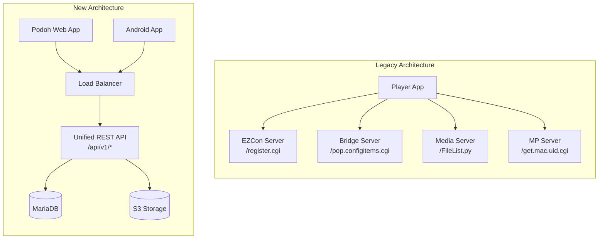
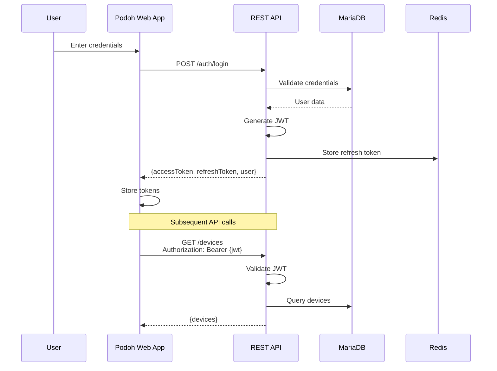
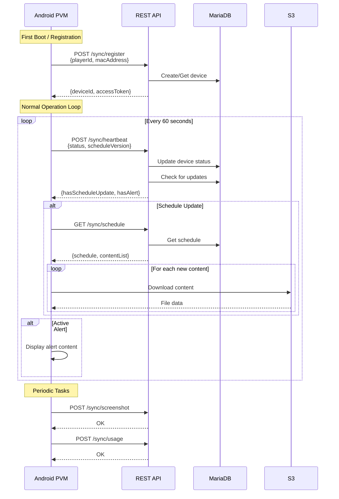
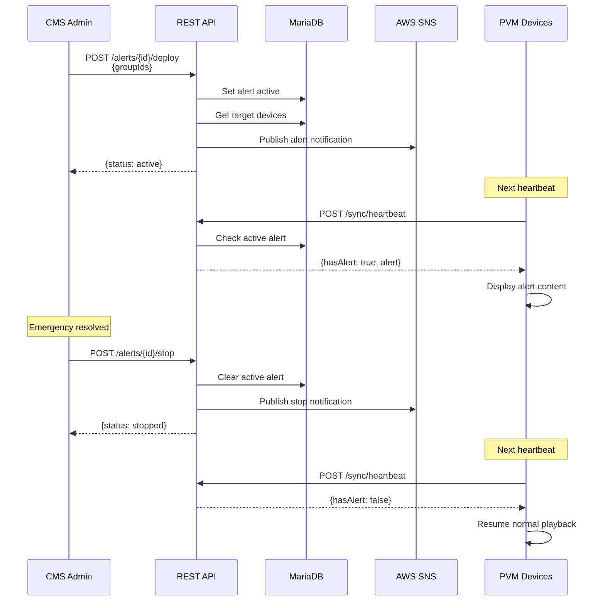

# API Specification
## Podoh RESTful API

**Document Version:** 1.0  
**Date:** January 12, 2026  
**Product:** Podoh Platform

---

## 1. Overview

### 1.1 Purpose
This document defines the RESTful API specification for the Podoh Server, providing a unified interface for both the Podoh Web Application and Android PVM devices.

### 1.2 Design Principles
- **RESTful Architecture**: Resource-based URLs with proper HTTP methods
- **Unified API**: Single API service replaces legacy multi-server architecture
- **JWT Authentication**: Secure token-based authentication
- **Consistent Response Format**: Standardized JSON responses
- **API Versioning**: URL-based versioning for backward compatibility

### 1.3 Architecture Comparison



---

## 2. API Conventions

### 2.1 Base URL
```
Production: https://api.podoh.io/api/v1
Staging:    https://api-staging.podoh.io/api/v1
```

### 2.2 Authentication
All endpoints except `/auth/login` and `/sync/register` require authentication via JWT Bearer token.

```
Authorization: Bearer <access_token>
```

### 2.3 HTTP Methods

| Method | Usage |
|--------|-------|
| GET | Retrieve resource(s) |
| POST | Create new resource |
| PUT | Update entire resource |
| PATCH | Partial update |
| DELETE | Remove resource |

### 2.4 Response Format

**Success Response:**
```json
{
  "success": true,
  "data": { },
  "meta": {
    "page": 1,
    "limit": 20,
    "total": 100,
    "totalPages": 5
  }
}
```

**Error Response:**
```json
{
  "success": false,
  "error": {
    "code": "ERROR_CODE",
    "message": "Human readable message",
    "details": []
  }
}
```

### 2.5 HTTP Status Codes

| Code | Meaning |
|------|---------|
| 200 | OK - Request succeeded |
| 201 | Created - Resource created |
| 204 | No Content - Successful deletion |
| 400 | Bad Request - Invalid input |
| 401 | Unauthorized - Invalid/missing token |
| 403 | Forbidden - Insufficient permissions |
| 404 | Not Found - Resource doesn't exist |
| 409 | Conflict - Resource already exists |
| 422 | Unprocessable Entity - Validation error |
| 429 | Too Many Requests - Rate limit exceeded |
| 500 | Internal Server Error |

### 2.6 Common Query Parameters

| Parameter | Type | Description |
|-----------|------|-------------|
| page | integer | Page number (default: 1) |
| limit | integer | Items per page (default: 20, max: 100) |
| sort | string | Sort field (prefix `-` for descending) |
| search | string | Search term |
| filter[field] | string | Filter by field value |

---

## 3. Authentication APIs

### 3.1 Login

Authenticates a user and returns access tokens.

```
POST /auth/login
```

**Request Body:**
```json
{
  "username": "admin",
  "password": "password123"
}
```

**Response (200 OK):**
```json
{
  "success": true,
  "data": {
    "accessToken": "eyJhbGciOiJSUzI1NiIs...",
    "refreshToken": "dGhpcyBpcyBhIHJlZnJlc2...",
    "expiresIn": 3600,
    "tokenType": "Bearer",
    "user": {
      "id": 1,
      "username": "admin",
      "role": "admin",
      "email": "admin@example.com",
      "groups": [
        {"id": 1, "name": "California"},
        {"id": 2, "name": "New York"}
      ]
    }
  }
}
```

**Error Response (401 Unauthorized):**
```json
{
  "success": false,
  "error": {
    "code": "INVALID_CREDENTIALS",
    "message": "Invalid username or password"
  }
}
```

---

### 3.2 Refresh Token

Refreshes an expired access token.

```
POST /auth/refresh
```

**Request Body:**
```json
{
  "refreshToken": "dGhpcyBpcyBhIHJlZnJlc2..."
}
```

**Response (200 OK):**
```json
{
  "success": true,
  "data": {
    "accessToken": "eyJhbGciOiJSUzI1NiIs...",
    "expiresIn": 3600
  }
}
```

---

### 3.3 Logout

Invalidates the current session.

```
POST /auth/logout
```

**Request Headers:**
```
Authorization: Bearer <access_token>
```

**Response (204 No Content)**

---

### 3.4 Get Current User

Returns the authenticated user's profile.

```
GET /auth/me
```

**Response (200 OK):**
```json
{
  "success": true,
  "data": {
    "id": 1,
    "username": "admin",
    "role": "admin",
    "email": "admin@example.com",
    "phone": "+1-555-0100",
    "groups": [
      {"id": 1, "name": "California"},
      {"id": 2, "name": "New York"}
    ],
    "createdAt": "2026-01-01T00:00:00Z"
  }
}
```

---

## 4. User Management APIs

### 4.1 List Users

Returns a paginated list of users.

```
GET /users
```

**Query Parameters:**

| Parameter | Type | Description |
|-----------|------|-------------|
| role | string | Filter by role (admin, manager, user) |
| groupId | integer | Filter by group |

**Response (200 OK):**
```json
{
  "success": true,
  "data": [
    {
      "id": 1,
      "username": "admin",
      "role": "admin",
      "email": "admin@example.com",
      "phone": "+1-555-0100",
      "groups": [{"id": 1, "name": "California"}],
      "createdAt": "2026-01-01T00:00:00Z"
    }
  ],
  "meta": {
    "page": 1,
    "limit": 20,
    "total": 45
  }
}
```

---

### 4.2 Create User

Creates a new user account.

```
POST /users
```

**Request Body:**
```json
{
  "username": "jsmith",
  "password": "securePassword123!",
  "role": "manager",
  "email": "jsmith@example.com",
  "phone": "+1-555-0101",
  "groupIds": [1, 2]
}
```

**Response (201 Created):**
```json
{
  "success": true,
  "data": {
    "id": 2,
    "username": "jsmith",
    "role": "manager",
    "email": "jsmith@example.com",
    "phone": "+1-555-0101",
    "groups": [
      {"id": 1, "name": "California"},
      {"id": 2, "name": "New York"}
    ],
    "createdAt": "2026-01-12T10:30:00Z"
  }
}
```

---

### 4.3 Get User

Returns a specific user.

```
GET /users/{id}
```

**Response (200 OK):**
```json
{
  "success": true,
  "data": {
    "id": 2,
    "username": "jsmith",
    "role": "manager",
    "email": "jsmith@example.com",
    "phone": "+1-555-0101",
    "groups": [{"id": 1, "name": "California"}],
    "createdAt": "2026-01-12T10:30:00Z",
    "updatedAt": "2026-01-12T10:30:00Z"
  }
}
```

---

### 4.4 Update User

Updates an existing user.

```
PUT /users/{id}
```

**Request Body:**
```json
{
  "email": "john.smith@example.com",
  "phone": "+1-555-0102",
  "groupIds": [1, 2, 3]
}
```

**Response (200 OK):**
```json
{
  "success": true,
  "data": {
    "id": 2,
    "username": "jsmith",
    "role": "manager",
    "email": "john.smith@example.com",
    "phone": "+1-555-0102",
    "groups": [
      {"id": 1, "name": "California"},
      {"id": 2, "name": "New York"},
      {"id": 3, "name": "Corporate"}
    ],
    "updatedAt": "2026-01-12T11:00:00Z"
  }
}
```

---

### 4.5 Delete User

Deletes a user account.

```
DELETE /users/{id}
```

**Response (204 No Content)**

---

### 4.6 Change Password

Changes a user's password.

```
POST /users/{id}/password
```

**Request Body:**
```json
{
  "currentPassword": "oldPassword123",
  "newPassword": "newSecurePassword456!"
}
```

**Response (200 OK):**
```json
{
  "success": true,
  "data": {
    "message": "Password changed successfully"
  }
}
```

---

## 5. Group Management APIs

### 5.1 List Groups

Returns all device groups.

```
GET /groups
```

**Response (200 OK):**
```json
{
  "success": true,
  "data": [
    {
      "id": 1,
      "name": "California",
      "deviceCount": 15,
      "contentCount": 42,
      "createdAt": "2026-01-01T00:00:00Z"
    },
    {
      "id": 2,
      "name": "New York",
      "deviceCount": 8,
      "contentCount": 28,
      "createdAt": "2026-01-01T00:00:00Z"
    }
  ]
}
```

---

### 5.2 Create Group

Creates a new device group.

```
POST /groups
```

**Request Body:**
```json
{
  "name": "Texas"
}
```

**Response (201 Created):**
```json
{
  "success": true,
  "data": {
    "id": 3,
    "name": "Texas",
    "deviceCount": 0,
    "contentCount": 0,
    "createdAt": "2026-01-12T10:30:00Z"
  }
}
```

---

### 5.3 Update Group

Updates a group's name.

```
PUT /groups/{id}
```

**Request Body:**
```json
{
  "name": "Texas Region"
}
```

**Response (200 OK):**
```json
{
  "success": true,
  "data": {
    "id": 3,
    "name": "Texas Region",
    "deviceCount": 5,
    "contentCount": 12,
    "updatedAt": "2026-01-12T11:00:00Z"
  }
}
```

---

### 5.4 Delete Group

Deletes a device group.

```
DELETE /groups/{id}
```

**Response (204 No Content)**

**Error Response (409 Conflict):**
```json
{
  "success": false,
  "error": {
    "code": "GROUP_HAS_DEVICES",
    "message": "Cannot delete group with assigned devices"
  }
}
```

---

## 6. Device Management APIs

### 6.1 List Devices

Returns a paginated list of devices.

```
GET /devices
```

**Query Parameters:**

| Parameter | Type | Description |
|-----------|------|-------------|
| groupId | integer | Filter by group |
| status | string | Filter by status (online, offline) |
| search | string | Search by name or player ID |

**Response (200 OK):**
```json
{
  "success": true,
  "data": [
    {
      "id": 1,
      "playerId": "PVM-ABC123DEF456",
      "name": "Store #101 - Main Entrance",
      "group": {
        "id": 1,
        "name": "California"
      },
      "status": "online",
      "ipAddress": "192.168.1.100",
      "lastSeen": "2026-01-12T10:29:30Z",
      "currentSchedule": {
        "id": 5,
        "name": "January Promotions",
        "version": 3
      },
      "systemInfo": {
        "model": "PVM-4200",
        "osVersion": "Android 11",
        "appVersion": "2.0.1"
      },
      "createdAt": "2026-01-01T00:00:00Z"
    }
  ],
  "meta": {
    "page": 1,
    "limit": 20,
    "total": 156
  }
}
```

---

### 6.2 Create Device (Manual Registration)

Manually registers a new device.

```
POST /devices
```

**Request Body:**
```json
{
  "playerId": "PVM-XYZ789GHI012",
  "name": "Store #102 - Checkout Area",
  "groupId": 1
}
```

**Response (201 Created):**
```json
{
  "success": true,
  "data": {
    "id": 2,
    "playerId": "PVM-XYZ789GHI012",
    "name": "Store #102 - Checkout Area",
    "group": {
      "id": 1,
      "name": "California"
    },
    "status": "offline",
    "createdAt": "2026-01-12T10:30:00Z"
  }
}
```

---

### 6.3 Get Device

Returns a specific device with detailed information.

```
GET /devices/{id}
```

**Response (200 OK):**
```json
{
  "success": true,
  "data": {
    "id": 1,
    "playerId": "PVM-ABC123DEF456",
    "name": "Store #101 - Main Entrance",
    "group": {
      "id": 1,
      "name": "California"
    },
    "status": "online",
    "ipAddress": "192.168.1.100",
    "lastSeen": "2026-01-12T10:29:30Z",
    "currentSchedule": {
      "id": 5,
      "name": "January Promotions",
      "version": 3,
      "deployedAt": "2026-01-10T08:00:00Z"
    },
    "systemInfo": {
      "model": "PVM-4200",
      "osVersion": "Android 11",
      "appVersion": "2.0.1",
      "freeMemory": 1073741824,
      "totalMemory": 4294967296,
      "macAddress": "AA:BB:CC:DD:EE:FF"
    },
    "settings": {
      "audioVolume": 50,
      "subtitleEnabled": true,
      "rssEnabled": true,
      "rssUrl": "https://news.example.com/rss"
    },
    "createdAt": "2026-01-01T00:00:00Z",
    "updatedAt": "2026-01-12T10:29:30Z"
  }
}
```

---

### 6.4 Update Device

Updates device information.

```
PUT /devices/{id}
```

**Request Body:**
```json
{
  "name": "Store #101 - Main Display",
  "groupId": 2
}
```

**Response (200 OK):**
```json
{
  "success": true,
  "data": {
    "id": 1,
    "playerId": "PVM-ABC123DEF456",
    "name": "Store #101 - Main Display",
    "group": {
      "id": 2,
      "name": "New York"
    },
    "updatedAt": "2026-01-12T11:00:00Z"
  }
}
```

---

### 6.5 Delete Device

Removes a device registration.

```
DELETE /devices/{id}
```

**Response (204 No Content)**

---

### 6.6 Update Device Settings

Updates device playback settings.

```
PATCH /devices/{id}/settings
```

**Request Body:**
```json
{
  "audioVolume": 75,
  "subtitleEnabled": false,
  "rssEnabled": true,
  "rssUrl": "https://news.example.com/feed.rss"
}
```

**Response (200 OK):**
```json
{
  "success": true,
  "data": {
    "audioVolume": 75,
    "subtitleEnabled": false,
    "rssEnabled": true,
    "rssUrl": "https://news.example.com/feed.rss"
  }
}
```

---

### 6.7 Get Device Screenshot

Returns the latest screenshot from a device.

```
GET /devices/{id}/screenshot
```

**Response (200 OK):**
```json
{
  "success": true,
  "data": {
    "url": "https://cdn.podoh.io/screenshots/device-1/latest.jpg",
    "capturedAt": "2026-01-12T10:28:00Z",
    "rotation": 0
  }
}
```

---

## 7. Content Management APIs

### 7.1 List Content

Returns a paginated list of content items.

```
GET /content
```

**Query Parameters:**

| Parameter | Type | Description |
|-----------|------|-------------|
| groupId | integer | Filter by group |
| type | string | Filter by type (video, image, html, stream) |
| search | string | Search by name |

**Response (200 OK):**
```json
{
  "success": true,
  "data": [
    {
      "id": 1,
      "name": "promo_video.mp4",
      "type": "video",
      "fileSize": 47396044,
      "mimeType": "video/mp4",
      "duration": 30,
      "resolution": "1920x1080",
      "group": {
        "id": 1,
        "name": "California"
      },
      "thumbnailUrl": "https://cdn.podoh.io/thumbnails/content-1.jpg",
      "downloadUrl": "https://cdn.podoh.io/content/group-1/promo_video.mp4",
      "createdAt": "2026-01-10T08:00:00Z"
    },
    {
      "id": 2,
      "name": "logo.png",
      "type": "image",
      "fileSize": 125829,
      "mimeType": "image/png",
      "resolution": "512x512",
      "group": {
        "id": 1,
        "name": "California"
      },
      "thumbnailUrl": "https://cdn.podoh.io/thumbnails/content-2.jpg",
      "downloadUrl": "https://cdn.podoh.io/content/group-1/logo.png",
      "createdAt": "2026-01-08T14:30:00Z"
    }
  ],
  "meta": {
    "page": 1,
    "limit": 20,
    "total": 89
  }
}
```

---

### 7.2 Upload Content

Uploads new content to the system.

```
POST /content
```

**Request (multipart/form-data):**

| Field | Type | Required | Description |
|-------|------|----------|-------------|
| file | file | Yes* | Media file (for video/image) |
| url | string | Yes* | URL (for html/stream) |
| type | string | Yes | Content type |
| groupId | integer | Yes | Target group |
| name | string | No | Custom name (defaults to filename) |

*Either `file` or `url` is required depending on type.

**Response (201 Created):**
```json
{
  "success": true,
  "data": {
    "id": 3,
    "name": "new_banner.jpg",
    "type": "image",
    "fileSize": 2621440,
    "mimeType": "image/jpeg",
    "resolution": "1920x1080",
    "group": {
      "id": 1,
      "name": "California"
    },
    "thumbnailUrl": "https://cdn.podoh.io/thumbnails/content-3.jpg",
    "downloadUrl": "https://cdn.podoh.io/content/group-1/new_banner.jpg",
    "createdAt": "2026-01-12T10:30:00Z"
  }
}
```

---

### 7.3 Get Content

Returns details of a specific content item.

```
GET /content/{id}
```

**Response (200 OK):**
```json
{
  "success": true,
  "data": {
    "id": 1,
    "name": "promo_video.mp4",
    "type": "video",
    "fileSize": 47396044,
    "mimeType": "video/mp4",
    "duration": 30,
    "resolution": "1920x1080",
    "hash": "a1b2c3d4e5f6...",
    "group": {
      "id": 1,
      "name": "California"
    },
    "thumbnailUrl": "https://cdn.podoh.io/thumbnails/content-1.jpg",
    "downloadUrl": "https://cdn.podoh.io/content/group-1/promo_video.mp4",
    "usedInSchedules": [
      {"id": 5, "name": "January Promotions"}
    ],
    "createdAt": "2026-01-10T08:00:00Z"
  }
}
```

---

### 7.4 Delete Content

Deletes a content item.

```
DELETE /content/{id}
```

**Response (204 No Content)**

**Error Response (409 Conflict):**
```json
{
  "success": false,
  "error": {
    "code": "CONTENT_IN_USE",
    "message": "Content is used in active schedules",
    "details": [
      {"scheduleId": 5, "scheduleName": "January Promotions"}
    ]
  }
}
```

---

### 7.5 Bulk Delete Content

Deletes multiple content items.

```
POST /content/bulk-delete
```

**Request Body:**
```json
{
  "ids": [3, 4, 5]
}
```

**Response (200 OK):**
```json
{
  "success": true,
  "data": {
    "deleted": [3, 4],
    "failed": [
      {"id": 5, "reason": "Content is used in active schedules"}
    ]
  }
}
```

---

## 8. Schedule Management APIs

### 8.1 List Schedules

Returns a paginated list of schedules.

```
GET /schedules
```

**Query Parameters:**

| Parameter | Type | Description |
|-----------|------|-------------|
| groupId | integer | Filter by group |
| search | string | Search by name |

**Response (200 OK):**
```json
{
  "success": true,
  "data": [
    {
      "id": 5,
      "name": "January Promotions",
      "group": {
        "id": 1,
        "name": "California"
      },
      "version": 3,
      "aspectRatio": "16:9",
      "rotation": 0,
      "deployedDevices": 12,
      "totalDevices": 15,
      "createdAt": "2026-01-05T09:00:00Z",
      "updatedAt": "2026-01-10T14:00:00Z"
    }
  ],
  "meta": {
    "page": 1,
    "limit": 20,
    "total": 23
  }
}
```

---

### 8.2 Create Schedule

Creates a new schedule.

```
POST /schedules
```

**Request Body:**
```json
{
  "name": "February Campaign",
  "groupId": 1,
  "aspectRatio": "16:9",
  "rotation": 0,
  "layout": {
    "zones": [
      {
        "id": "video-main",
        "type": "video",
        "position": {
          "left": 0,
          "top": 0,
          "right": 70,
          "bottom": 80
        },
        "contentIds": [1, 2, 3],
        "settings": {
          "loop": true
        }
      },
      {
        "id": "image-side",
        "type": "image",
        "position": {
          "left": 70,
          "top": 0,
          "right": 100,
          "bottom": 50
        },
        "contentIds": [4, 5],
        "settings": {
          "displayTime": 10
        }
      },
      {
        "id": "logo",
        "type": "logo",
        "position": {
          "left": 70,
          "top": 50,
          "right": 100,
          "bottom": 80
        },
        "contentIds": [6]
      },
      {
        "id": "ticker",
        "type": "newsTicker",
        "position": {
          "left": 0,
          "top": 80,
          "right": 100,
          "bottom": 100
        },
        "settings": {
          "rssUrl": "https://news.example.com/rss",
          "speed": "medium"
        }
      }
    ]
  },
  "timing": {
    "subSchedules": [
      {
        "name": "Weekday Hours",
        "playbackStart": "08:00",
        "playbackEnd": "22:00",
        "daysOfWeek": ["mon", "tue", "wed", "thu", "fri"],
        "repeat": true
      },
      {
        "name": "Weekend Hours",
        "playbackStart": "10:00",
        "playbackEnd": "20:00",
        "daysOfWeek": ["sat", "sun"],
        "repeat": true
      }
    ]
  }
}
```

**Response (201 Created):**
```json
{
  "success": true,
  "data": {
    "id": 6,
    "name": "February Campaign",
    "group": {
      "id": 1,
      "name": "California"
    },
    "version": 1,
    "aspectRatio": "16:9",
    "rotation": 0,
    "layout": { },
    "timing": { },
    "createdAt": "2026-01-12T10:30:00Z"
  }
}
```

---

### 8.3 Get Schedule

Returns a specific schedule with full details.

```
GET /schedules/{id}
```

**Response (200 OK):**
```json
{
  "success": true,
  "data": {
    "id": 5,
    "name": "January Promotions",
    "group": {
      "id": 1,
      "name": "California"
    },
    "version": 3,
    "aspectRatio": "16:9",
    "rotation": 0,
    "layout": {
      "zones": [
        {
          "id": "video-main",
          "type": "video",
          "position": {
            "left": 0,
            "top": 0,
            "right": 70,
            "bottom": 80
          },
          "content": [
            {
              "id": 1,
              "name": "promo_video.mp4",
              "type": "video",
              "downloadUrl": "https://cdn.podoh.io/content/group-1/promo_video.mp4",
              "hash": "a1b2c3d4..."
            }
          ],
          "settings": {
            "loop": true
          }
        }
      ]
    },
    "timing": {
      "subSchedules": [
        {
          "id": 1,
          "name": "Business Hours",
          "playbackStart": "08:00",
          "playbackEnd": "22:00",
          "daysOfWeek": ["mon", "tue", "wed", "thu", "fri"],
          "repeat": true
        }
      ]
    },
    "deployments": [
      {
        "deviceId": 1,
        "deviceName": "Store #101",
        "status": "deployed",
        "deployedAt": "2026-01-10T08:00:00Z"
      }
    ],
    "createdAt": "2026-01-05T09:00:00Z",
    "updatedAt": "2026-01-10T14:00:00Z"
  }
}
```

---

### 8.4 Update Schedule

Updates an existing schedule.

```
PUT /schedules/{id}
```

**Request Body:**
```json
{
  "name": "January Promotions v2",
  "layout": { },
  "timing": { }
}
```

**Response (200 OK):**
```json
{
  "success": true,
  "data": {
    "id": 5,
    "name": "January Promotions v2",
    "version": 4,
    "updatedAt": "2026-01-12T11:00:00Z"
  }
}
```

---

### 8.5 Delete Schedule

Deletes a schedule.

```
DELETE /schedules/{id}
```

**Response (204 No Content)**

---

### 8.6 Deploy Schedule

Deploys a schedule to devices.

```
POST /schedules/{id}/deploy
```

**Request Body:**
```json
{
  "deviceIds": [1, 2, 3],
  "deployAll": false
}
```

**Response (200 OK):**
```json
{
  "success": true,
  "data": {
    "deploymentId": "deploy-abc123",
    "scheduleId": 5,
    "scheduleName": "January Promotions",
    "scheduleVersion": 3,
    "targetDevices": 3,
    "status": "in_progress",
    "initiatedAt": "2026-01-12T11:00:00Z"
  }
}
```

---

### 8.7 Get Deployment Status

Returns the status of a deployment.

```
GET /schedules/{id}/deployments/{deploymentId}
```

**Response (200 OK):**
```json
{
  "success": true,
  "data": {
    "deploymentId": "deploy-abc123",
    "scheduleId": 5,
    "status": "completed",
    "targetDevices": 3,
    "completedDevices": 3,
    "failedDevices": 0,
    "deviceStatuses": [
      {"deviceId": 1, "deviceName": "Store #101", "status": "deployed"},
      {"deviceId": 2, "deviceName": "Store #102", "status": "deployed"},
      {"deviceId": 3, "deviceName": "Store #103", "status": "deployed"}
    ],
    "initiatedAt": "2026-01-12T11:00:00Z",
    "completedAt": "2026-01-12T11:02:30Z"
  }
}
```

---

## 9. Alert Management APIs

### 9.1 List Alerts

Returns all alert content items.

```
GET /alerts
```

**Response (200 OK):**
```json
{
  "success": true,
  "data": [
    {
      "id": 1,
      "name": "Emergency Evacuation",
      "content": {
        "id": 10,
        "name": "evacuate.mp4",
        "type": "video",
        "thumbnailUrl": "https://cdn.podoh.io/thumbnails/content-10.jpg"
      },
      "isActive": false,
      "lastDeployedAt": "2025-12-15T14:00:00Z",
      "createdAt": "2025-01-01T00:00:00Z"
    },
    {
      "id": 2,
      "name": "Fire Alert",
      "content": {
        "id": 11,
        "name": "fire_alert.jpg",
        "type": "image"
      },
      "isActive": false,
      "createdAt": "2025-01-01T00:00:00Z"
    }
  ]
}
```

---

### 9.2 Create Alert

Creates a new alert configuration.

```
POST /alerts
```

**Request Body:**
```json
{
  "name": "Lockdown Alert",
  "contentId": 12
}
```

**Response (201 Created):**
```json
{
  "success": true,
  "data": {
    "id": 3,
    "name": "Lockdown Alert",
    "content": {
      "id": 12,
      "name": "lockdown.mp4",
      "type": "video"
    },
    "isActive": false,
    "createdAt": "2026-01-12T10:30:00Z"
  }
}
```

---

### 9.3 Deploy Alert

Immediately deploys an alert to devices.

```
POST /alerts/{id}/deploy
```

**Request Body:**
```json
{
  "groupIds": [1, 2],
  "deployAll": false
}
```

**Response (200 OK):**
```json
{
  "success": true,
  "data": {
    "alertId": 1,
    "alertName": "Emergency Evacuation",
    "status": "active",
    "targetGroups": ["California", "New York"],
    "targetDevices": 23,
    "deployedAt": "2026-01-12T11:00:00Z"
  }
}
```

---

### 9.4 Stop Alert

Stops an active alert and resumes normal playback.

```
POST /alerts/{id}/stop
```

**Response (200 OK):**
```json
{
  "success": true,
  "data": {
    "alertId": 1,
    "alertName": "Emergency Evacuation",
    "status": "stopped",
    "stoppedAt": "2026-01-12T11:30:00Z",
    "duration": "00:30:00"
  }
}
```

---

### 9.5 Get Active Alert

Returns the currently active alert (if any).

```
GET /alerts/active
```

**Response (200 OK) - Alert Active:**
```json
{
  "success": true,
  "data": {
    "id": 1,
    "name": "Emergency Evacuation",
    "content": {
      "id": 10,
      "name": "evacuate.mp4",
      "downloadUrl": "https://cdn.podoh.io/content/alerts/evacuate.mp4"
    },
    "targetGroups": ["California", "New York"],
    "deployedAt": "2026-01-12T11:00:00Z"
  }
}
```

**Response (200 OK) - No Alert:**
```json
{
  "success": true,
  "data": null
}
```

---

## 10. Usage Report APIs

### 10.1 Get Device Usage

Returns usage statistics for a device.

```
GET /reports/usage
```

**Query Parameters:**

| Parameter | Type | Required | Description |
|-----------|------|----------|-------------|
| deviceId | integer | Yes | Device ID |
| startDate | date | Yes | Start date (YYYY-MM-DD) |
| endDate | date | Yes | End date (YYYY-MM-DD) |

**Response (200 OK):**
```json
{
  "success": true,
  "data": {
    "device": {
      "id": 1,
      "name": "Store #101 - Main Entrance",
      "group": "California"
    },
    "period": {
      "startDate": "2026-01-01",
      "endDate": "2026-01-12"
    },
    "summary": {
      "totalPlayTime": 864000,
      "totalPlayTimeFormatted": "240:00:00",
      "contentPlayed": 15,
      "averageDailyUptime": "20:00:00"
    },
    "contentUsage": [
      {
        "contentId": 1,
        "contentName": "promo_video.mp4",
        "contentType": "video",
        "playCount": 2880,
        "totalPlayTime": 86400,
        "totalPlayTimeFormatted": "24:00:00"
      },
      {
        "contentId": 2,
        "contentName": "banner.jpg",
        "contentType": "image",
        "playCount": 8640,
        "totalPlayTime": 86400,
        "totalPlayTimeFormatted": "24:00:00"
      }
    ],
    "dailyStats": [
      {
        "date": "2026-01-01",
        "uptimeSeconds": 72000,
        "uptimeFormatted": "20:00:00"
      }
    ]
  }
}
```

---

### 10.2 Export Usage Report

Exports usage data as Excel file.

```
GET /reports/usage/export
```

**Query Parameters:**

| Parameter | Type | Required | Description |
|-----------|------|----------|-------------|
| deviceId | integer | No | Device ID (omit for all) |
| groupId | integer | No | Group ID |
| startDate | date | Yes | Start date |
| endDate | date | Yes | End date |
| format | string | No | Export format (xlsx, csv) |

**Response:**
```
Content-Type: application/vnd.openxmlformats-officedocument.spreadsheetml.sheet
Content-Disposition: attachment; filename="usage-report-2026-01-12.xlsx"

[Binary Excel data]
```

---

### 10.3 Get Group Statistics

Returns aggregated statistics for a group.

```
GET /reports/groups/{id}/stats
```

**Query Parameters:**

| Parameter | Type | Required | Description |
|-----------|------|----------|-------------|
| startDate | date | Yes | Start date |
| endDate | date | Yes | End date |

**Response (200 OK):**
```json
{
  "success": true,
  "data": {
    "group": {
      "id": 1,
      "name": "California"
    },
    "period": {
      "startDate": "2026-01-01",
      "endDate": "2026-01-12"
    },
    "deviceStats": {
      "totalDevices": 15,
      "onlineDevices": 14,
      "offlineDevices": 1,
      "averageUptime": "95.2%"
    },
    "contentStats": {
      "totalContent": 42,
      "mostPlayedContent": [
        {"name": "promo_video.mp4", "playCount": 43200}
      ]
    }
  }
}
```

---

## 11. Device Sync APIs

These APIs are used by Android PVM devices to synchronize with the CMS server.

### 11.1 Register Device

Registers a new device with the server.

```
POST /sync/register
```

**Request Body:**
```json
{
  "playerId": "PVM-ABC123DEF456",
  "macAddress": "AA:BB:CC:DD:EE:FF",
  "deviceInfo": {
    "model": "PVM-4200",
    "osVersion": "Android 11",
    "appVersion": "2.0.1"
  }
}
```

**Response (200 OK):**
```json
{
  "success": true,
  "data": {
    "deviceId": 1,
    "playerId": "PVM-ABC123DEF456",
    "status": "registered",
    "accessToken": "device-token-xyz...",
    "serverTime": "2026-01-12T10:30:00Z"
  }
}
```

**Response (200 OK) - Already Registered:**
```json
{
  "success": true,
  "data": {
    "deviceId": 1,
    "playerId": "PVM-ABC123DEF456",
    "status": "already_registered",
    "accessToken": "device-token-xyz...",
    "serverTime": "2026-01-12T10:30:00Z"
  }
}
```

---

### 11.2 Heartbeat

Sends device status and checks for updates.

```
POST /sync/heartbeat
```

**Request Headers:**
```
Authorization: Bearer <device_access_token>
```

**Request Body:**
```json
{
  "playerId": "PVM-ABC123DEF456",
  "status": "playing",
  "ipAddress": "192.168.1.100",
  "currentScheduleVersion": 3,
  "systemInfo": {
    "freeMemory": 1073741824,
    "totalMemory": 4294967296,
    "cpuUsage": 45
  }
}
```

**Response (200 OK) - No Updates:**
```json
{
  "success": true,
  "data": {
    "serverTime": "2026-01-12T10:30:00Z",
    "hasScheduleUpdate": false,
    "hasSettingsUpdate": false,
    "hasAlert": false
  }
}
```

**Response (200 OK) - Updates Available:**
```json
{
  "success": true,
  "data": {
    "serverTime": "2026-01-12T10:30:00Z",
    "hasScheduleUpdate": true,
    "scheduleVersion": 4,
    "hasSettingsUpdate": true,
    "hasAlert": true,
    "alert": {
      "id": 1,
      "name": "Emergency Evacuation",
      "contentUrl": "https://cdn.podoh.io/content/alerts/evacuate.mp4",
      "contentType": "video"
    }
  }
}
```

---

### 11.3 Get Schedule

Retrieves the current schedule for the device.

```
GET /sync/schedule
```

**Request Headers:**
```
Authorization: Bearer <device_access_token>
```

**Response (200 OK):**
```json
{
  "success": true,
  "data": {
    "scheduleId": 5,
    "scheduleName": "January Promotions",
    "version": 4,
    "aspectRatio": "16:9",
    "rotation": 0,
    "layout": {
      "zones": [
        {
          "id": "video-main",
          "type": "video",
          "layer": 10,
          "position": {
            "left": 0,
            "top": 0,
            "right": 70,
            "bottom": 80
          },
          "content": [
            {
              "name": "promo_video.mp4",
              "url": "https://cdn.podoh.io/content/group-1/promo_video.mp4",
              "hash": "a1b2c3d4e5f6...",
              "fileSize": 47396044,
              "duration": 30
            }
          ],
          "settings": {
            "loop": true
          }
        },
        {
          "id": "image-side",
          "type": "image",
          "layer": 2,
          "position": {
            "left": 70,
            "top": 0,
            "right": 100,
            "bottom": 50
          },
          "content": [
            {
              "name": "banner.jpg",
              "url": "https://cdn.podoh.io/content/group-1/banner.jpg",
              "hash": "f6e5d4c3b2a1...",
              "fileSize": 2621440,
              "duration": 10
            }
          ],
          "settings": {
            "displayTime": 10
          }
        },
        {
          "id": "ticker",
          "type": "newsTicker",
          "layer": 8,
          "position": {
            "left": 0,
            "top": 80,
            "right": 100,
            "bottom": 100
          },
          "settings": {
            "rssUrl": "https://news.example.com/rss",
            "speed": "medium",
            "backgroundColor": "#000000",
            "textColor": "#FFFFFF"
          }
        }
      ]
    },
    "timing": {
      "subSchedules": [
        {
          "name": "Business Hours",
          "playbackStart": "08:00",
          "playbackEnd": "22:00",
          "daysOfWeek": ["mon", "tue", "wed", "thu", "fri"],
          "repeat": true
        }
      ],
      "defaultImageDisplayTime": 10
    }
  }
}
```

---

### 11.4 Get Settings

Retrieves device settings.

```
GET /sync/settings
```

**Request Headers:**
```
Authorization: Bearer <device_access_token>
```

**Response (200 OK):**
```json
{
  "success": true,
  "data": {
    "audioVolume": 50,
    "subtitleEnabled": true,
    "subtitleText": "Welcome to our store!",
    "rssEnabled": true,
    "rssUrl": "https://news.example.com/rss",
    "syncInterval": 60,
    "screenshotInterval": 300
  }
}
```

---

### 11.5 Upload Screenshot

Uploads a device screenshot.

```
POST /sync/screenshot
```

**Request Headers:**
```
Authorization: Bearer <device_access_token>
Content-Type: multipart/form-data
```

**Request Body (multipart/form-data):**

| Field | Type | Description |
|-------|------|-------------|
| image | file | Screenshot image (JPEG) |
| rotation | integer | Screen rotation (0, 90, 180, 270) |

**Response (200 OK):**
```json
{
  "success": true,
  "data": {
    "uploaded": true,
    "timestamp": "2026-01-12T10:30:00Z"
  }
}
```

---

### 11.6 Submit Usage Log

Submits playback usage statistics.

```
POST /sync/usage
```

**Request Headers:**
```
Authorization: Bearer <device_access_token>
```

**Request Body:**
```json
{
  "playerId": "PVM-ABC123DEF456",
  "date": "2026-01-12",
  "logs": [
    {
      "contentName": "promo_video.mp4",
      "contentType": "video",
      "playTimeSeconds": 86400,
      "playCount": 2880
    },
    {
      "contentName": "banner.jpg",
      "contentType": "image",
      "playTimeSeconds": 43200,
      "playCount": 4320
    }
  ]
}
```

**Response (200 OK):**
```json
{
  "success": true,
  "data": {
    "received": true,
    "logCount": 2
  }
}
```

---

## 12. Data Types

### 12.1 Enumerations

**User Roles:**
```typescript
type UserRole = "admin" | "manager" | "user";
```

**Device Status:**
```typescript
type DeviceStatus = "online" | "offline";
```

**Content Type:**
```typescript
type ContentType = "video" | "image" | "html" | "stream";
```

**Zone Type:**
```typescript
type ZoneType = 
  | "video"       // Layer 10
  | "image"       // Layers 2-4
  | "logo"        // Layer 5
  | "clock"       // Layer 6
  | "subtitle"    // Layer 7
  | "newsTicker"  // Layers 8-9
  | "html"        // Layer 1
  | "wallpaper"   // Layer 0
  | "camera";     // Layer 11
```

**Aspect Ratio:**
```typescript
type AspectRatio = "16:9" | "4:3" | "5:4" | "16:4.5";
```

**Rotation:**
```typescript
type Rotation = 0 | 90 | 180 | 270;
```

### 12.2 Common Objects

**Position:**
```typescript
interface Position {
  left: number;   // Percentage (0-100)
  top: number;    // Percentage (0-100)
  right: number;  // Percentage (0-100)
  bottom: number; // Percentage (0-100)
}
```

**Zone:**
```typescript
interface Zone {
  id: string;
  type: ZoneType;
  layer: number;
  position: Position;
  content?: Content[];
  settings?: ZoneSettings;
}
```

**SubSchedule:**
```typescript
interface SubSchedule {
  name: string;
  playbackStart: string;  // HH:mm format
  playbackEnd: string;    // HH:mm format
  daysOfWeek: DayOfWeek[];
  repeat: boolean;
}

type DayOfWeek = "mon" | "tue" | "wed" | "thu" | "fri" | "sat" | "sun";
```

---

## 13. Error Codes

| Code | HTTP Status | Description |
|------|-------------|-------------|
| INVALID_CREDENTIALS | 401 | Invalid username or password |
| TOKEN_EXPIRED | 401 | Access token has expired |
| TOKEN_INVALID | 401 | Invalid or malformed token |
| FORBIDDEN | 403 | Insufficient permissions |
| RESOURCE_NOT_FOUND | 404 | Requested resource not found |
| VALIDATION_ERROR | 422 | Request validation failed |
| DUPLICATE_RESOURCE | 409 | Resource already exists |
| RESOURCE_IN_USE | 409 | Cannot delete resource in use |
| GROUP_HAS_DEVICES | 409 | Group has assigned devices |
| CONTENT_IN_USE | 409 | Content used in schedules |
| FILE_TOO_LARGE | 413 | Uploaded file exceeds limit |
| UNSUPPORTED_FILE_TYPE | 415 | File type not supported |
| RATE_LIMIT_EXCEEDED | 429 | Too many requests |
| INTERNAL_ERROR | 500 | Internal server error |

---

## 14. Rate Limiting

| Endpoint Category | Rate Limit |
|-------------------|------------|
| Authentication | 10 requests/minute |
| Podoh Web APIs | 100 requests/minute |
| Device Sync APIs | 60 requests/minute per device |
| File Upload | 10 requests/minute |

Rate limit headers are included in all responses:
```
X-RateLimit-Limit: 100
X-RateLimit-Remaining: 95
X-RateLimit-Reset: 1736683800
```

---

## 15. API Flow Diagrams

### 15.1 Podoh Web Authentication Flow



### 15.2 Device Sync Flow



### 15.3 Security Alert Flow



---

## 16. Migration from Legacy APIs

### 16.1 Endpoint Mapping

| Legacy Endpoint | New Endpoint |
|-----------------|--------------|
| `GET /register.cgi` | `POST /sync/register` |
| `GET /get.bridge.server.cgi` | (Not needed - unified API) |
| `GET /set.bridge.server.cgi` | (Not needed - unified API) |
| `GET /pop.configitems.cgi` | `POST /sync/heartbeat` + `GET /sync/schedule` |
| `POST /set.sysinfo.cgi` | `POST /sync/heartbeat` |
| `POST /screenshot.cgi` | `POST /sync/screenshot` |
| `POST /usagereport.cgi` | `POST /sync/usage` |
| `GET /FileList.py` | `GET /sync/schedule` (includes content list) |
| `GET /files/{group}/{file}` | Direct S3/CloudFront download |
| `GET /get.mac.uid.cgi` | `POST /sync/register` |

### 16.2 Authentication Migration

| Legacy | New |
|--------|-----|
| MD5 magic hash | JWT Bearer token |
| Query parameter auth | Authorization header |
| No refresh mechanism | Refresh token flow |

---

## Document Approval

| Role | Name | Signature | Date |
|------|------|-----------|------|
| API Lead | | | |
| Backend Lead | | | |
| Security Lead | | | |
| QA Lead | | | |

