# System Design Document
## Podoh Backend Services

**Document Version:** 2.0  
**Date:** January 9, 2026  
**Product:** Podoh Platform - Digital Signage CMS

---

## 1. Introduction

### 1.1 Purpose
This document provides the technical design specification for the Podoh Backend Services, detailing the cloud-native architecture, AWS infrastructure, API design, database schema, and integration patterns.

### 1.2 Scope
This design covers:
- AWS ECS containerized service architecture
- AWS RDS MariaDB database design
- RESTful API specifications
- Service communication patterns
- Security implementation
- Scalability and high availability

### 1.3 References
- BRD-CMS-Server.md
- AWS Well-Architected Framework

---

## 2. System Architecture

### 2.1 High-Level Architecture


### 2.2 Component Architecture


### 2.3 Four-Tier Architecture Overview


---

## 3. AWS Infrastructure Design

### 3.1 VPC Architecture


### 3.2 ECS Service Architecture


### 3.3 RDS Multi-AZ Architecture


---

## 4. API Service Design

### 4.1 Service Layer Architecture


### 4.2 Authentication Flow


### 4.3 Device Sync Flow


### 4.4 Security Alert Flow


---

## 5. Database Design

### 5.1 Entity Relationship Diagram


### 5.2 Database Schema Details

```sql
-- Users Table
CREATE TABLE users (
    id BIGINT PRIMARY KEY AUTO_INCREMENT,
    username VARCHAR(50) NOT NULL UNIQUE,
    password_hash VARCHAR(255) NOT NULL,
    role ENUM('admin', 'manager', 'user') NOT NULL DEFAULT 'user',
    email VARCHAR(100),
    phone VARCHAR(20),
    created_at TIMESTAMP DEFAULT CURRENT_TIMESTAMP,
    updated_at TIMESTAMP DEFAULT CURRENT_TIMESTAMP ON UPDATE CURRENT_TIMESTAMP,
    INDEX idx_username (username),
    INDEX idx_role (role)
) ENGINE=InnoDB DEFAULT CHARSET=utf8mb4;

-- Groups Table
CREATE TABLE groups (
    id BIGINT PRIMARY KEY AUTO_INCREMENT,
    name VARCHAR(100) NOT NULL,
    created_at TIMESTAMP DEFAULT CURRENT_TIMESTAMP,
    updated_at TIMESTAMP DEFAULT CURRENT_TIMESTAMP ON UPDATE CURRENT_TIMESTAMP
) ENGINE=InnoDB DEFAULT CHARSET=utf8mb4;

-- Devices Table
CREATE TABLE devices (
    id BIGINT PRIMARY KEY AUTO_INCREMENT,
    player_id VARCHAR(100) NOT NULL UNIQUE,
    name VARCHAR(100),
    group_id BIGINT,
    status ENUM('online', 'offline') DEFAULT 'offline',
    ip_address VARCHAR(45),
    last_seen TIMESTAMP,
    created_at TIMESTAMP DEFAULT CURRENT_TIMESTAMP,
    FOREIGN KEY (group_id) REFERENCES groups(id) ON DELETE SET NULL,
    INDEX idx_player_id (player_id),
    INDEX idx_group_id (group_id),
    INDEX idx_status (status)
) ENGINE=InnoDB DEFAULT CHARSET=utf8mb4;

-- Content Table
CREATE TABLE content (
    id BIGINT PRIMARY KEY AUTO_INCREMENT,
    name VARCHAR(255) NOT NULL,
    type ENUM('video', 'image', 'html', 'stream') NOT NULL,
    s3_key VARCHAR(500) NOT NULL,
    file_size BIGINT,
    group_id BIGINT,
    thumbnail_key VARCHAR(500),
    created_at TIMESTAMP DEFAULT CURRENT_TIMESTAMP,
    FOREIGN KEY (group_id) REFERENCES groups(id) ON DELETE SET NULL,
    INDEX idx_group_id (group_id),
    INDEX idx_type (type)
) ENGINE=InnoDB DEFAULT CHARSET=utf8mb4;

-- Schedules Table
CREATE TABLE schedules (
    id BIGINT PRIMARY KEY AUTO_INCREMENT,
    name VARCHAR(100) NOT NULL,
    group_id BIGINT,
    layout JSON NOT NULL,
    timing JSON,
    version INT DEFAULT 1,
    created_at TIMESTAMP DEFAULT CURRENT_TIMESTAMP,
    updated_at TIMESTAMP DEFAULT CURRENT_TIMESTAMP ON UPDATE CURRENT_TIMESTAMP,
    FOREIGN KEY (group_id) REFERENCES groups(id) ON DELETE SET NULL,
    INDEX idx_group_id (group_id)
) ENGINE=InnoDB DEFAULT CHARSET=utf8mb4;
```

---

## 6. API Specifications

### 6.1 API Request/Response Format


### 6.2 API Response Structures

**Success Response:**
```json
{
  "success": true,
  "data": { },
  "meta": {
    "page": 1,
    "limit": 20,
    "total": 100
  }
}
```

**Error Response:**
```json
{
  "success": false,
  "error": {
    "code": "VALIDATION_ERROR",
    "message": "Invalid input data",
    "details": [
      {"field": "name", "message": "Name is required"}
    ]
  }
}
```

### 6.3 API Endpoint Summary


---

## 7. Security Design

### 7.1 Security Architecture


### 7.2 JWT Token Structure


---

## 8. Scalability Design

### 8.1 Auto-Scaling Configuration


### 8.2 Content Delivery Architecture


---

## 9. Monitoring & Logging

### 9.1 Observability Stack


### 9.2 Key Metrics

| Metric | Threshold | Action |
|--------|-----------|--------|
| API Response Time (p95) | > 500ms | Alert |
| Error Rate | > 1% | Alert |
| CPU Utilization | > 70% | Scale out |
| Database Connections | > 80% | Alert |
| S3 Request Errors | > 0.1% | Alert |

---

## 10. Deployment Design

### 10.1 CI/CD Pipeline


### 10.2 Blue/Green Deployment

```mermaid
graph TB
    subgraph "Production"
        ALB[Load Balancer]
        
        subgraph "Blue (Current)"
            BLUE1[Task v1.0]
            BLUE2[Task v1.0]
        end
        
        subgraph "Green (New)"
            GREEN1[Task v1.1]
            GREEN2[Task v1.1]
        end
    end
    
    ALB -->|100%| BLUE1
    ALB -->|100%| BLUE2
    ALB -.->|0%| GREEN1
    ALB -.->|0%| GREEN2
    
    NOTE[Traffic shift:<br/>100% Blue → 100% Green]
```



---

## 11. Disaster Recovery

### 11.1 Backup Strategy

```mermaid
graph TB
    subgraph "RDS Backup"
        AUTO[Automated Backups<br/>Daily, 7-day retention]
        SNAP[Manual Snapshots<br/>Before major changes]
        PITR[Point-in-Time Recovery<br/>5-minute granularity]
    end
    
    subgraph "S3 Backup"
        VERSION[Versioning<br/>All objects]
        REPLICA[Cross-Region Replication<br/>DR region]
    end
    
    subgraph "Configuration"
        IaC[Infrastructure as Code<br/>Terraform/CloudFormation]
    end
```

### 11.2 Recovery Objectives

| Metric | Target |
|--------|--------|
| RTO (Recovery Time Objective) | < 1 hour |
| RPO (Recovery Point Objective) | < 5 minutes |
| Failover Time (RDS) | < 2 minutes |

---

## 12. Appendix

### 12.1 Technology Stack

| Layer | Technology |
|-------|------------|
| Runtime | Node.js 20 LTS / Java 17 |
| Framework | Express.js / Spring Boot |
| Database | MariaDB 10.11 |
| Cache | Redis 7 |
| Container | Docker |
| Orchestration | AWS ECS Fargate |
| CDN | AWS CloudFront |
| Storage | AWS S3 |
| Secrets | AWS Secrets Manager |
| Monitoring | AWS CloudWatch |

### 12.2 AWS Resource Naming Convention

| Resource | Pattern | Example |
|----------|---------|---------|
| ECS Cluster | `{env}-cms-cluster` | `prod-cms-cluster` |
| ECS Service | `{env}-cms-api` | `prod-cms-api` |
| RDS Instance | `{env}-cms-db` | `prod-cms-db` |
| S3 Bucket | `{env}-cms-media-{account}` | `prod-cms-media-123456` |
| ALB | `{env}-cms-alb` | `prod-cms-alb` |

---

## Document Approval

| Role | Name | Signature | Date |
|------|------|-----------|------|
| Technical Lead | | | |
| DevOps Lead | | | |
| Security Lead | | | |
| AWS Architect | | | |
