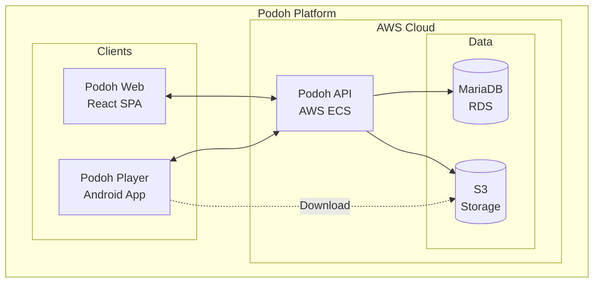

# Podoh Platform 🍇
## Business Proposal

**제안일:** 2026년 1월  
**제안사:** [Company Name]  
**문서버전:** 1.0

---

## 1. Executive Summary

**Podoh**는 PVM(Public View Monitor) 디바이스를 위한 차세대 콘텐츠 관리 플랫폼입니다. 클라우드 네이티브 아키텍처 기반의 RESTful API 서버와 직관적인 웹 애플리케이션을 통해, 기업 고객이 분산된 디스플레이 네트워크를 중앙에서 효율적으로 관리할 수 있습니다.

### 핵심 가치 제안

| 항목 | 내용 |
|------|------|
| **중앙 집중 관리** | 수백 대의 PVM 디바이스를 단일 웹 인터페이스에서 관리 |
| **실시간 배포** | 콘텐츠 및 스케줄 변경사항을 즉시 모든 디바이스에 배포 |
| **긴급 알림** | 비상 상황 시 10초 이내 전체 디스플레이에 보안 알림 송출 |
| **사용량 분석** | 콘텐츠별 재생 시간 추적 및 리포트 생성 |

---

## 2. 시스템 구성

### 구성 요소

| 컴포넌트 | 설명 | 기술 스택 |
|----------|------|-----------|
| **Podoh Web** | 관리자용 웹 애플리케이션 | React, CloudFront |
| **Podoh API** | RESTful 백엔드 서비스 | Node.js/Spring, AWS ECS |
| **Podoh Player** | PVM용 안드로이드 앱 | Android Native |
| **Database** | 관계형 데이터베이스 | MariaDB on AWS RDS |
| **Storage** | 미디어 파일 저장소 | AWS S3 + CloudFront CDN |

---

## 3. 주요 기능

### 3.1 디바이스 관리
- PVM 디바이스 등록 및 그룹 관리
- 실시간 온라인/오프라인 상태 모니터링
- 원격 설정 변경 및 스크린샷 캡처

### 3.2 콘텐츠 관리
- 비디오(MP4, AVI, MKV), 이미지(JPG, PNG), HTML, 스트리밍 지원
- 그룹별 콘텐츠 라이브러리 관리
- 썸네일 자동 생성 및 미리보기

### 3.3 스케줄 & 레이아웃 편집기
- 드래그앤드롭 방식의 멀티존 레이아웃 디자인
- 비디오, 이미지, 로고, 시계, 뉴스 티커 등 11개 레이어 지원
- 시간대별/요일별 서브 스케줄 설정

### 3.4 보안 알림 시스템
- 긴급 상황 시 즉시 알림 콘텐츠 배포
- 그룹 또는 전체 디바이스 대상 선택
- 원클릭 알림 해제 및 정상 콘텐츠 복귀

### 3.5 사용량 리포트
- 디바이스별/콘텐츠별 재생 시간 통계
- Excel 내보내기 지원
- 광고 과금을 위한 증빙 데이터 제공

---

## 4. 비용 제안

### 4.1 개발 비용

| 항목 | 내용 | 비용 |
|------|------|-----:|
| Podoh API 개발 | RESTful 백엔드 서비스 | $8,000 |
| Podoh Web 개발 | React 웹 애플리케이션 | $7,000 |
| Podoh Player 개발 | Android 앱 (기존 앱 현대화) | $6,000 |
| 통합 테스트 및 배포 | QA, CI/CD 구축, 문서화 | $4,000 |
| **총 개발 비용** | | **$25,000** |

### 4.2 라이센스 비용

| 항목 | 단가 | 비고 |
|------|-----:|------|
| **Podoh Player 라이센스** | **$50/대** | PVM 디바이스당 영구 라이센스 |

#### 라이센스 볼륨 예시

| 디바이스 수 | 라이센스 비용 | 총 비용 (개발+라이센스) |
|------------:|-------------:|----------------------:|
| 50대 | $2,500 | $27,500 |
| 100대 | $5,000 | $30,000 |
| 200대 | $10,000 | $35,000 |
| 500대 | $25,000 | $50,000 |

### 4.3 운영 비용 (예상, 월간)

| 항목 | 예상 비용 | 비고 |
|------|----------:|------|
| AWS ECS (API 서버) | $50-150 | 트래픽에 따라 자동 확장 |
| AWS RDS (데이터베이스) | $50-100 | db.t3.medium 기준 |
| AWS S3 + CloudFront | $20-100 | 저장 용량 및 전송량에 따라 |
| **월간 운영 비용** | **$120-350** | 디바이스 100대 기준 |

> ⚠️ AWS 운영 비용은 귀사 AWS 계정에서 직접 결제됩니다.

---

## 5. 개발 일정

| 단계 | 기간 | 산출물 |
|------|------|--------|
| **Phase 1: API 개발** | 4주 | Podoh API v1.0, Swagger 문서 |
| **Phase 2: Web 개발** | 4주 | Podoh Web v1.0 |
| **Phase 3: Player 개발** | 3주 | Podoh Player v1.0 (Android) |
| **Phase 4: 통합 및 배포** | 2주 | 전체 시스템 통합, AWS 배포 |
| **총 개발 기간** | **13주** | 약 3개월 |

---

## 6. 기대 효과

### 비즈니스 효과

| 효과 | 설명 |
|------|------|
| **운영 효율성** | 현장 방문 없이 100% 원격 콘텐츠 관리 |
| **비용 절감** | 기존 분산 시스템 대비 관리 인력 50% 절감 |
| **수익 창출** | 광고 재생 시간 데이터 기반 과금 체계 구축 |
| **확장성** | 디바이스 10대부터 10,000대까지 유연한 확장 |

### 기술적 우위

- ✅ 클라우드 네이티브 아키텍처 (AWS 기반)
- ✅ 99.99% 가용성 (Multi-AZ 구성)
- ✅ 자동 확장 (Auto Scaling)
- ✅ 글로벌 CDN을 통한 빠른 콘텐츠 전송
- ✅ RESTful API 기반 확장 가능한 설계

---

## 7. 왜 Podoh인가?

| 기존 시스템 | Podoh |
|-------------|-------|
| 다중 서버 구조 (Bridge, EZCon, MP 등) | 단일 통합 API |
| CGI 기반 레거시 프로토콜 | 현대적 RESTful API |
| 제한적인 확장성 | AWS 기반 무제한 확장 |
| 단일 장애점 존재 | 고가용성 아키텍처 |
| 제한적인 문서화 | OpenAPI 3.0 표준 문서 |

---

## 8. 다음 단계

1. **기술 미팅** - 상세 요구사항 논의 및 Q&A
2. **계약 체결** - 개발 범위 및 일정 확정
3. **킥오프** - 개발 착수 및 주간 진행 보고
4. **인수 테스트** - 고객 환경에서 최종 검증
5. **운영 전환** - 시스템 인수 및 운영 교육

---

## 연락처

| 항목 | 내용 |
|------|------|
| **담당자** | [Name] |
| **이메일** | [email@company.com] |
| **전화** | [Phone Number] |
| **웹사이트** | [https://company.com] |

---

*본 제안서는 Podoh 플랫폼에 대한 초기 제안이며, 상세 협의를 통해 조정될 수 있습니다.*

**Podoh 🍇 - 포도처럼 연결된 디스플레이 네트워크**
