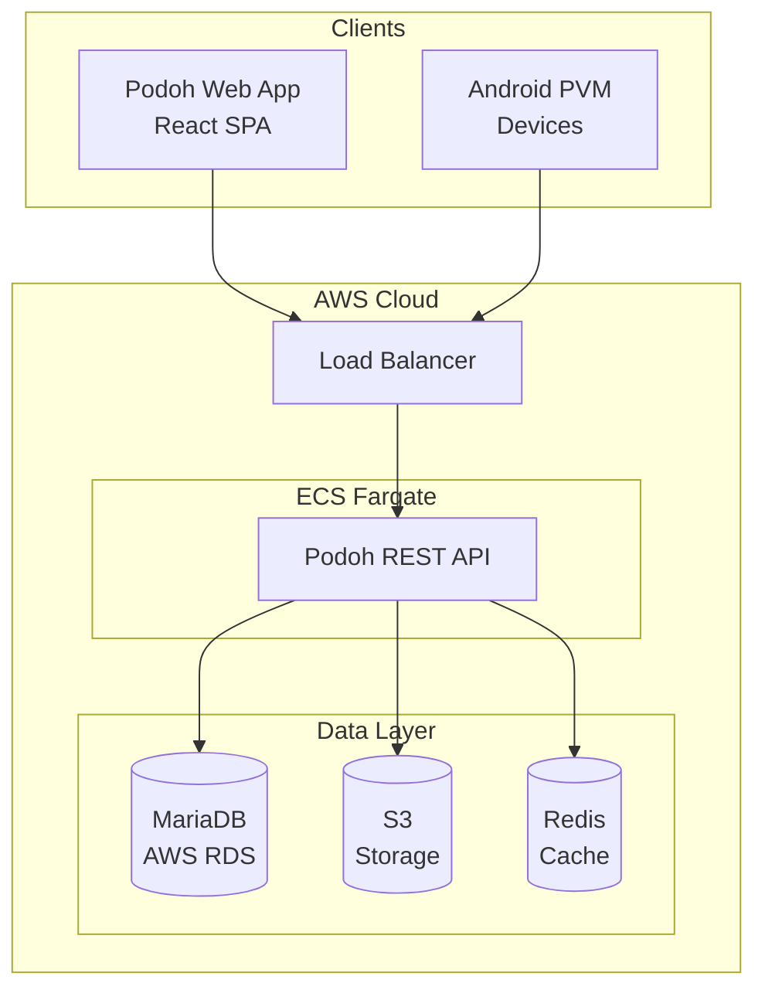

# Podoh 🍇

**Content Management Platform for PVM Displays**

Podoh is a modern, cloud-native platform for managing PVM (Public View Monitor) devices. It provides a unified RESTful API for content management, scheduling, device synchronization, and security alerts.

---

## 📚 Documentation

### Interactive API Documentation

| Resource | Description |
|----------|-------------|
| [**Swagger UI**](https://nicechester.github.io/podoh-design/) | Interactive API explorer - Try out API endpoints directly |

### Design Documents

| Document | Description |
|----------|-------------|
| [**API Specification**](https://nicechester.github.io/podoh-design/API-Specification-CMS-Server.md) | Complete RESTful API specification with examples |
| [**Server Design**](https://nicechester.github.io/podoh-design/Design-CMS-Server.md) | Backend architecture, AWS infrastructure, database design |
| [**OpenAPI Spec**](https://nicechester.github.io/podoh-design/openapi.yaml) | OpenAPI 3.0 specification (YAML) |

### Business Requirements

| Document | Description |
|----------|-------------|
| [**BRD - Backend Services**](https://nicechester.github.io/podoh-design/BRD-CMS-Server.md) | Backend API platform requirements |
| [**BRD - Web Application**](https://nicechester.github.io/podoh-design/BRD-CMS-Software.md) | Frontend web application requirements |
| [**BRD - PVM Monitor**](https://nicechester.github.io/podoh-design/BRD-SmartAD-PVM-Monitor.md) | PVM hardware device requirements |

---

## 🚀 Quick Links

- **Production API**: `https://api.podoh.io/api/v1`
- **Staging API**: `https://api-staging.podoh.io/api/v1`

---

## 🔑 API Overview

### Authentication
```bash
POST /api/v1/auth/login
```

### Core Resources

| Endpoint | Description |
|----------|-------------|
| `/auth/*` | User authentication & session management |
| `/users/*` | User account management |
| `/groups/*` | Device group management |
| `/devices/*` | PVM device management |
| `/content/*` | Media content management |
| `/schedules/*` | Layout & scheduling |
| `/alerts/*` | Security alert system |
| `/reports/*` | Usage analytics |
| `/sync/*` | Device synchronization (for Android PVM) |

---

## 🏗️ Architecture



---

## 📦 Features

- **Device Management**: Register and monitor PVM devices
- **Content Library**: Upload and manage video, image, HTML, and stream content
- **Layout Editor**: Visual drag-and-drop schedule designer
- **Multi-zone Layouts**: Video, image, logo, clock, ticker zones
- **Scheduled Playback**: Time-based content scheduling
- **Security Alerts**: Emergency broadcast system
- **Usage Analytics**: Playback statistics and reporting
- **Multi-language**: English, Spanish, French, Russian, Portuguese, Korean

---

## 📄 License

Proprietary - All rights reserved

---

*Podoh - 포도 (grape) 🍇*

